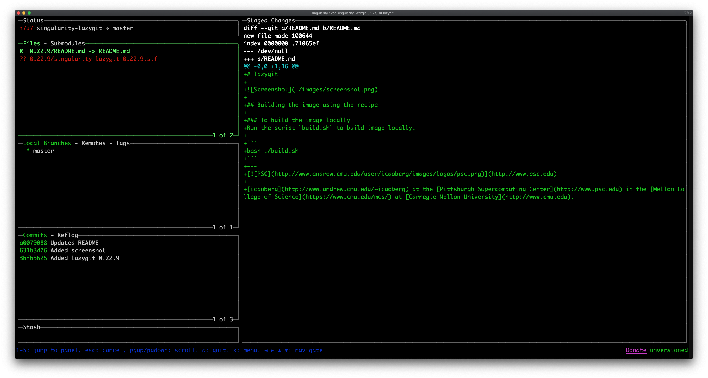

# singularity-lazygit

Singularity recipe for [lazygit](https://github.com/jesseduffield/lazygit).

## Installing the container on Bridges 2
Copy the

* `SIF` file
* and the `lazygit` script

to `/opt/packages/lazygit/4.8.25`.

Copy the file `modulefile.lua` to `/opt/modulefiles/lazygit` as `4.8.25.lua`.

## Building the image using the recipe
### To build the image locally
Run the script `build.sh` to build image locally.

```
bash ./build.sh
```

### To build the image remotely
Run the script `rbuild.sh` to build image remotely.

```
bash ./rbuild.sh
```

## To run tests
To run the available tests, run the command

```
bash ./test.sh
```

---
Copyright © 2020-2021 Pittsburgh Supercomputing Center. All Rights Reserved.

The [Biomedical Applications Group](https://www.psc.edu/biomedical-applications/) at the [Pittsburgh Supercomputing
Center](http://www.psc.edu) in the [Mellon College of Science](https://www.cmu.edu/lazygits/) at [Carnegie Mellon University](http://www.cmu.edu).
